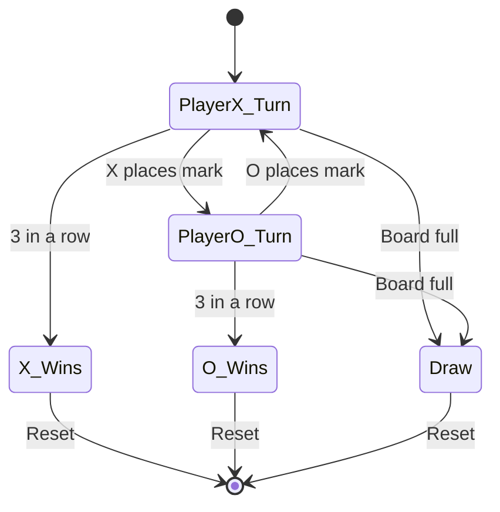
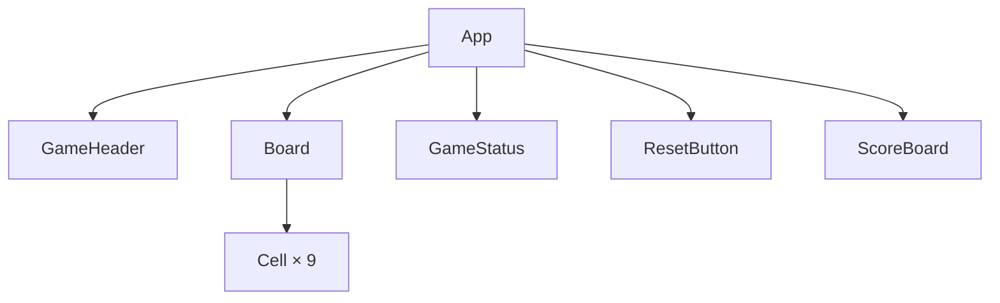

# Tic-Tac-Toe — Game Specification

## Overview

A classic two-player Tic-Tac-Toe game built as a single React component. Players take turns placing X and O on a 3×3 grid. The first player to align three marks in a row, column, or diagonal wins. If all nine cells are filled with no winner, the game ends in a draw.

The goal is a clean, minimal implementation that feels satisfying to play — snappy interactions, clear visual feedback, and zero external dependencies beyond React and Tailwind.

## Game Flow



## Architecture

### Component Tree



### State Shape

The entire game state lives in a single `useReducer`:

```typescript
type Player = "X" | "O";

interface GameState {
  board: (Player | null)[];   // length 9, row-major order
  currentPlayer: Player;
  winner: Player | "draw" | null;
  winningLine: number[] | null;  // indices of the 3 winning cells
  scores: { X: number; O: number; draws: number };
}
```

| Index | Position     |
| ----- | ------------ |
| 0     | top-left     |
| 1     | top-center   |
| 2     | top-right    |
| 3     | middle-left  |
| 4     | center       |
| 5     | middle-right |
| 6     | bottom-left  |
| 7     | bottom-center|
| 8     | bottom-right |

## Win Detection

### Winning Combinations

There are exactly 8 possible winning lines:

```typescript
const WINNING_LINES = [
  [0, 1, 2], // top row
  [3, 4, 5], // middle row
  [6, 7, 8], // bottom row
  [0, 3, 6], // left column
  [1, 4, 7], // center column
  [2, 5, 8], // right column
  [0, 4, 8], // diagonal top-left → bottom-right
  [2, 4, 6], // diagonal top-right → bottom-left
];
```

### Algorithm

After each move, check all 8 lines. For each line `[a, b, c]`:
- If `board[a] === board[b] === board[c]` and is not `null` → that player wins
- If no winner and all 9 cells are filled → draw

This is O(1) per move (constant 8 checks) so no optimization is needed.

## Implementation Plan

### Phase 1: Core Game Logic

- [ ] Define `GameState` type and initial state
- [ ] Implement `gameReducer` with actions: `PLACE_MARK`, `RESET`
- [ ] Write `checkWinner()` utility using the 8 winning lines
- [ ] Wire up `useReducer` in the root component

### Phase 2: Board & Cell Rendering

- [ ] Render 3×3 grid using CSS Grid
- [ ] Each cell shows X, O, or empty
- [ ] Click handler dispatches `PLACE_MARK` with cell index
- [ ] Disable click on occupied cells and when game is over
- [ ] Hover preview: show faded current player mark on empty cells

### Phase 3: Visual Feedback

- [ ] Highlight winning line cells with a distinct background color
- [ ] Animate mark placement (scale-in transition)
- [ ] X and O use different colors (e.g., blue for X, rose for O)
- [ ] Draw state dims the entire board slightly
- [ ] Pulse animation on the winning line

### Phase 4: Game Status & Score

- [ ] Display current turn indicator: "Player X's turn" / "Player O's turn"
- [ ] Display winner announcement or draw message
- [ ] Persistent score tracker across rounds (X wins, O wins, draws)
- [ ] Reset button that clears the board but preserves scores
- [ ] "New Game" button that resets everything including scores

### Phase 5: Polish

- [ ] Keyboard accessibility: tab to cells, Enter to place mark
- [ ] Responsive layout that works on mobile
- [ ] Subtle grid lines instead of heavy borders
- [ ] Clean typography and spacing
- [ ] Disable pointer events during win animation

## Component Specifications

### Cell

| Prop | Type | Description |
| ---- | ---- | ----------- |
| `value` | `Player \| null` | Current mark in this cell |
| `onClick` | `() => void` | Called when cell is clicked |
| `isWinning` | `boolean` | Whether this cell is part of the winning line |
| `isDisabled` | `boolean` | Prevents interaction |
| `currentPlayer` | `Player` | Used for hover preview |

### GameStatus

Displays one of three states:
- **In progress**: "Player X's turn" with the player's color
- **Winner**: "Player X wins!" with a celebration style
- **Draw**: "It's a draw!" in a neutral style

### ScoreBoard

Simple three-column layout:

```
  X: 3    Draws: 1    O: 2
```

Updates after each game ends. Persists across resets.

## Styling Guidelines

- Grid: `grid grid-cols-3` with `gap-1` on a dark background to create gridlines
- Cells: `bg-white` squares, `aspect-square`, `text-4xl font-bold`
- X color: `text-blue-600`
- O color: `text-rose-500`
- Winning cells: `bg-yellow-100` with a `ring-2 ring-yellow-400`
- Hover on empty cell: `bg-slate-50` with faded current player mark at `opacity-20`
- Reset button: `bg-slate-900 text-white rounded-lg px-4 py-2`

## Edge Cases

- Clicking an already occupied cell does nothing
- Clicking any cell after game is over does nothing
- Rapid double-clicks should not cause issues (reducer is synchronous)
- Board should handle window resize gracefully
- Score state survives game resets but not page refreshes (no persistence needed)

## Out of Scope

- AI opponent (single player mode)
- Online multiplayer
- Board size variations (4×4, 5×5)
- Undo/redo moves
- Sound effects
- Local storage persistence
