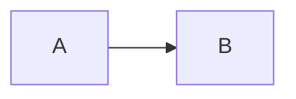

# Markdown Parser Reference

This document describes how to parse raw markdown spec files into the JSON
structure that SpecObserver expects. The agent performs this parsing at generation
time — it reads the markdown, builds the JSON, and embeds it in the artifact.

## Target data shape

```json
{
  "files": [
    {
      "name": "spec.md",
      "frontmatter": { "title": "...", "status": "...", ... },
      "sections": [
        {
          "id": "section-0",
          "level": 2,
          "title": "Section Title",
          "content": "Raw content between this heading and the next...",
          "children": [ /* nested sections */ ]
        }
      ]
    }
  ]
}
```

## Parsing algorithm

### Step 1: Extract frontmatter

If the file starts with `---`, extract everything between the first and second
`---` line. Parse as key-value pairs (simple YAML — split on `:` for each line).

```
Input:
---
title: My Project
status: draft
version: 1.0
---
# Rest of document...

Output frontmatter:
{ "title": "My Project", "status": "draft", "version": "1.0" }
```

The agent doesn't need a full YAML parser — simple key: value extraction works
for spec frontmatter. Handle these edge cases:
- Values with colons (e.g., `url: https://example.com`) — split on first `:` only
- Quoted values — strip surrounding quotes
- Missing frontmatter — return `null`

### Step 2: Split into sections by heading

Walk through lines after frontmatter. Every line that starts with `#` marks
a new section. The heading level is the number of `#` characters.

```
## Overview          → level 2, title "Overview"
### Goals            → level 3, title "Goals"
#### Sub-goal        → level 4, title "Sub-goal"
```

Everything between two headings of the **same or higher** level belongs to the
preceding heading's `content` field.

### Step 3: Build the hierarchy

Sections are nested by level:
- `h2` sections are top-level
- `h3` sections are children of the preceding `h2`
- `h4` sections are children of the preceding `h3`
- And so on

Use a stack-based approach:

```
stack = []
root_sections = []

for each (level, title, content):
  section = { id: generate_id(), level, title, content, children: [] }

  // Pop the stack until we find a parent with a lower level
  while stack is not empty AND stack.top.level >= level:
    stack.pop()

  if stack is empty:
    root_sections.push(section)
  else:
    stack.top.children.push(section)

  stack.push(section)
```

### Step 4: Generate section IDs

Use a deterministic scheme based on position:
- Top-level sections: `section-0`, `section-1`, etc.
- Children: `section-0-0`, `section-0-1`, etc.
- Deep children: `section-0-0-0`, etc.

This keeps IDs stable and predictable for scroll tracking.

### Step 5: Preserve raw content

The `content` field for each section should contain the **raw markdown text**
between headings — do NOT pre-parse it into blocks at this stage. The React
component handles block parsing at render time via `parseContentBlocks()`.

This means the content field will contain mixed markdown:
```
This is a paragraph.

- [ ] A checklist item
- [x] A done item

| Column A | Column B |
| -------- | -------- |
| Cell 1   | Cell 2   |



Some more text.
```

All of this gets parsed by the component at render time.

## Handling multiple files

When the developer provides multiple markdown files:
1. Parse each file independently using the steps above
2. Use the filename (without path) as the `name` field
3. Wrap all files in the `{ "files": [...] }` structure

## Edge cases

- **No h2 headings**: If the document only uses h1 or jumps straight to h3,
  treat whatever heading levels exist as the hierarchy. The lowest heading
  level present becomes the "root" level.
- **Content before first heading**: Create a synthetic section with
  `title: "Introduction"` and `level: 2` to hold this content.
- **Empty sections**: Sections with no content between headings should have
  `content: ""` — don't skip them, they still appear in the ToC.
- **Very long content**: No special handling needed — the UI handles this
  via collapsible sections and scroll.
- **h1 headings**: Treat `# Title` as the document title. If frontmatter
  already has a title, ignore the h1. Otherwise, add it to frontmatter as
  `title`. Don't create a collapsible section for h1.
